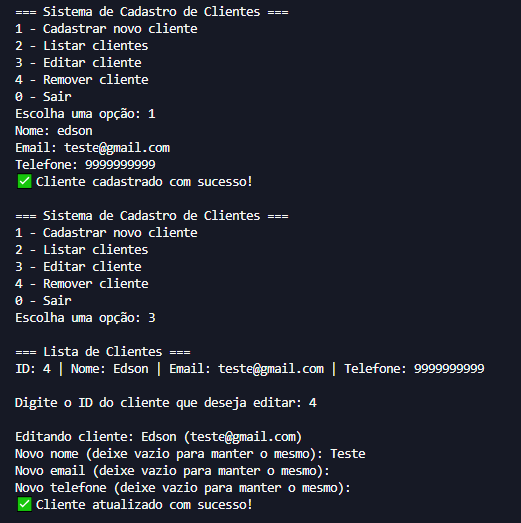

# 🧾 Sistema de Cadastro de Clientes




Um sistema simples de **cadastro de clientes**, desenvolvido com **Python** e **MySQL**.  
Ideal para estudos sobre integração de Python com banco de dados e CRUD (Create, Read, Update, Delete).

---

## 🚀 Funcionalidades

- 🟢 **Cadastrar clientes** (nome, e-mail e telefone)
- 📋 **Listar** todos os clientes cadastrados
- ✏️ **Editar** informações de um cliente existente
- 🗑️ **Remover** clientes com confirmação
- 🔒 **Validação** do número de telefone (aceita apenas números)
- 💾 Criação automática do banco e da tabela se não existirem

---

## 🛠️ Tecnologias Utilizadas

- **Python 3.10+**
- **MySQL** (com **MySQL Workbench** ou servidor local)
- **mysql-connector-python**

---

## 📂 Estrutura do Projeto
```
📁 Cadastro_Clientes/
 ┣ 📂 src/
 ┃ ┣ 📜 conexao.py
 ┃ ┣ 📜 cadastrar.py
 ┃ ┣ 📜 main.py
 ┃ ┣ 📜 editar.py
 ┃ ┣ 📜 remover.py
 ┃ ┗ 📜 listar.py
 ┣ 📂 imagens/
 ┃ ┣ 🖼️ principal.PNG
 ┃ ┗ 🖼️ parteDois.PNG
 ┣ 📜 requirements.txt
 ┗ 📜 README.md
 ```


---

## ⚙️ Como Instalar e Rodar

1️⃣ **Clone o repositório**
```bash
git clone https://github.com/seuusuario/Cadastro_Clientes.git

cd Cadastro_Clientes

pip install -r requirements.txt

python src/main.py


